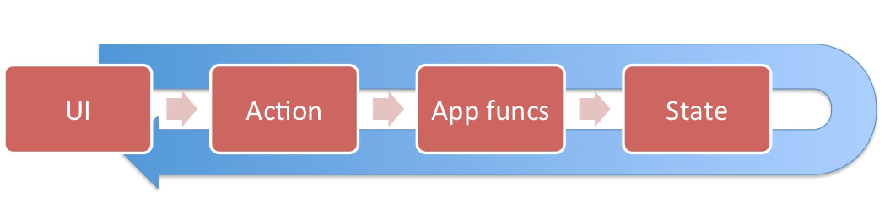

# Reax

Reax supports you in setting up a reactive loop for your UI:

1. The UI dispatches an `Action`. This is a **literal object** which should at least define a `type` property, such that it is identifiable in the following activities.
2. The `Action` is handled. This would typically trigger a change of the current state.
3. Handling the action results in **new application state**. This state determines completely what is rendered as UI.

React has allowed to model user interaction in this way, replacing classical architectures like
MVC or MVVM with an interaction model which embraces concepts from functional programming and eliminates numerous bugs surrounding the syncing of UI with application state. 

Reax provides a way to

* Connect React components to a reax application
* Define handlers for actions
* Have a dispatcher available to dispatch actions or even observables of actions (more on that later).
  